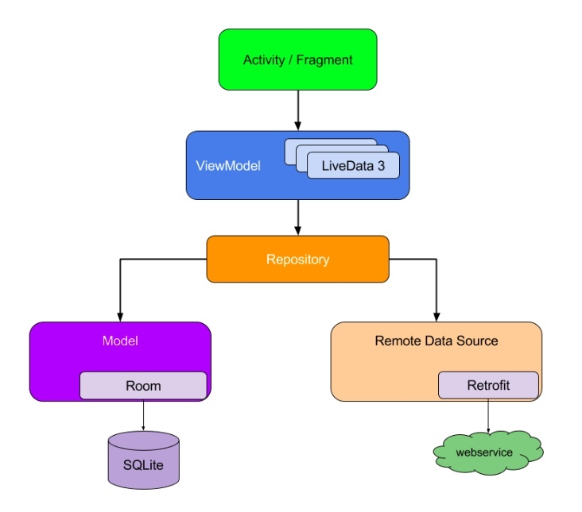

L'ensemble du projet m'a pris environ 10 heures, dont la plupart ont été consacrées à la réflexion. Selon les exigences du projet, deux interfaces RecyclerView sont nécessaires, une affiche tous les albums et leurs auteurs. Un autre montrant toutes les photos de cet album. J'ai choisi l'architecture MVVM que je connais mieux. 

L'application n'a qu'une seule activité, qui utilise des fragments pour afficher l'interface utilisateur et la navigation pour opérer les sauts entre eux. Le ViewModel est utilisé pour conserver les données liées aux éléments de l'interface utilisateur afin de garantir que ces données ne sont pas perdues lors de la rotation de l'écran et est responsable de la communication avec les données. Le Repository est utilisé pour mettre en cache les données du réseau, afin que les utilisateurs puissent continuer à accéder aux données mises en cache lorsqu'ils n'ont plus le réseau, afin d'assurer l'expérience utilisateur autant que possible.

 
Photo Album application avec Dagger-Hilt, Coroutines, ViewBinding, Room, Retrofit et Picasso basé sur l'architecture MVVM.
 
### L'application a les packages suivants:
1. **adatper** : Il contient tous les adaptateurs.
2. **api**: Il s'agit d'un service de Retrofit contenant l'interface de requête.
3. **di**: Dépendance fournissant des classes avec Dagger-Hilt.
4. **model**: les data models.
5. **repository**:  Il contient tous les repository pour pour la gestion des opérations de données.
6. **ui**: Il contient tous les calsses de vue.
7. **viewmodels**: Il contient tous les viewmodels.

### Tech-stack
- **Coroutines** - effectuer des opérations en arrière-plan
- **Retrofit** - appel réseau
- **Navigation** - navigation dans l'application
- **LiveData** - informer les vues des modifications de la base de données
- **ViewModel** - stocker et gérer les données liées à l'interface utilisateur d'une manière consciente du cycle de vie
- **Room** - stocker le cache en cas non connecté
- **Picasso** - Chargement d'images depuis le réseau 

### Modern Architecture
- Clean Architecture
- Single activity architecture using Navigation component
- MVVM
- Android Architecture components (ViewModel, LiveData, Navigation)
- Android KTX - Jetpack Kotlin extensions

### A faire：
- Migrer de LiveData vers Flow
- Gestion des erreurs réseau
- Test unitaire

